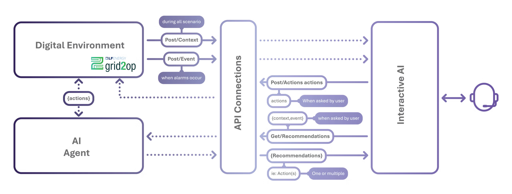

# AINETUS

**Last Updated:** 2026-05-21

## Table of Contents

- [Basic Info](#basic-info)
- [Description](#description)
- [Overview](#overview)
- [Technical Profile](#technical-profile)
- [Grid Context](#grid-context)
- [Related Projects](#related-projects)
- [Maturity & Adoption](#maturity--adoption)
- [Learn More](#learn-more)
- [Additional Notes](#additional-notes)

## Basic Info

- LF Energy webpage: https://lfenergy.org/projects/ainetus/
- Website:
- Code: https://github.com/ainetus
- Documentation:
- Calendar: https://zoom-lfx.platform.linuxfoundation.org/meetings/ainetus
- LinkedIn:
- Community:
	- Mailing List:
	- Slack: https://lfenergy.slack.com/archives/C0AJT9E76TG
- LFX Insights:
- Other:

## Description

AI-based decision support for complex grid operations, with components that augment power system operator decision-making by combining reinforcement learning agents, explainability, and human-AI interaction to improve situational awareness and manage complex grid conditions.

## Overview

AINETUS — AI for Safety-Critical Network Infrastructures — develops open source AI components that augment power system operator decision-making in the control room. The stack is built around three layers: reinforcement learning agents that propose remedial actions (topology switching, redispatch) for managing congestion and contingencies; alarm functions that predict agent or grid failures and quantify uncertainty; and an Interactive AI interface that surfaces alerts, context, and recommendations to a human operator who remains in control. A graph neural solver provides physics-informed approximations of AC power flow inside the agent loop.

Traditional control-room tools enable robust physics-based decisions but can be too slow for real-time actions like topology optimization, and they struggle with partial observability and risk modeling. At the same time, operators face a fragmented work environment of multi-screen applications and rising cognitive load as grids absorb more renewables and tighter operating margins. AINETUS targets this gap with human-centric AI: the AI does not replace the operator, but rapidly distills large volumes of data into context-aware recommendations with explanations and uncertainty estimates, so the operator can decide faster while remaining accountable.

*AINETUS interaction model: the digital environment (Grid2Op) posts context and events through API connectors to the Interactive AI interface, which can request recommendations from the AI agent on demand.*

AINETUS is an LF Energy-hosted continuation of work from AI4REALNET, a Horizon Europe research project coordinated by INESC TEC. AI4REALNET addresses AI for safety-critical networks across three sectors — electricity, railway, and air traffic management — while AINETUS narrows scope to electricity and brings the power-grid work into the LF Energy ecosystem, where it integrates with Grid2Op (as the simulation environment) and OperatorFabric (as a control-room HMI host). The current user base is transmission operators (RTE, TenneT) and the research consortium; the code is not yet deployed in production.

## Technical Profile

### What It Does

Provides reinforcement learning agents, a graph neural power flow solver, alarm and failure prediction functions, and a human-AI interactive interface that together deliver explainable remedial-action recommendations to transmission grid operators.

### Problem(s) Solved

Closes the gap between traditional physics-based control-room tools — which are robust but too slow for real-time actions like topology optimization — and the operational pressures created by renewable integration, tighter margins, and rising operator cognitive load. Provides a human-in-the-loop AI assistant that surfaces recommendations with explanations and uncertainty so operators can act faster without giving up accountability.

### Key Capabilities

- Reinforcement learning agents for remedial action recommendation, including distributed reinforcement learning (decomposing the grid control problem into correlated sub-problems), co-learning between AI and human, DeepQExpert, Safe RL, and GNN-based power grid control
- Graph neural solver for power flow that enforces local conservation as a physics-informed optimization criterion (non-supervised learning), predicting active line flows from substation injections
- Alarm functions: AI agent failure prediction (forecasting agent breakdown several steps ahead), uncertainty modeling, and an explainability dashboard
- Interactive AI interface presenting operators with alerts, real-time grid context with zoom and timeline tools, and ranked AI-generated recommendations (topological changes, redispatch) the operator can accept or reject
- API-connector architecture that decouples the digital environment, AI agent, and human-AI interface, so each component can be developed and tested independently
- Built on Grid2Op as the training and evaluation environment, with components designed to integrate with OperatorFabric for control-room delivery

### Relevant Standards

None. AINETUS is an AI/ML decision-support stack and does not directly implement grid communication or data model standards.

## Grid Context

### Grid Segment

Transmission

### Function

Operations

### Industry Solution Categories

#### Solution Type

- Operator Decision Support: Real-time AI advisory that recommends remedial actions (topology switching, redispatch) to grid operators in response to congestion and contingencies, with explanations and uncertainty estimates so operators remain accountable for the action taken.

#### Component of

- Energy Management System (EMS): AINETUS is not an internal EMS module but an external AI advisory layer that consumes state from the EMS and surfaces recommendations to operators through a separate interface. The closest match for a utility evaluating "AI-assisted operations" within an EMS modernization or procurement.

### Cross-Cutting Tags

- **Project Intent:** Applied
- **AI/ML:** Yes
- **Deliverable Type:** Software

## Related Projects

- **Grid2Op**: Dependency — Grid2Op is the simulation environment in which AINETUS agents are trained and evaluated. AINETUS contributes back to the Grid2Op ecosystem by exercising its sequential decision-making interface with production-oriented AI components.
- **OperatorFabric**: Complementary — OperatorFabric provides the control-room notification and coordination platform; AINETUS provides the AI recommendations and explanations that such a platform can surface to operators.

## Maturity & Adoption

### LF Energy Stage

Sandbox

### Deployment Maturity

R&D

### Supporting / Adopting Organizations

- INESC TEC (project coordination; research organization)
- Politecnico di Milano (university)
- Fraunhofer IEE (research organization)
- IRT SystemX (research organization)
- University of Amsterdam (university)
- RTE (transmission system operator, France)
- TenneT (transmission system operator, Netherlands/Germany)
- enliteAI (SME)

## Learn More

- [AINETUS – AI for safety-critical NEtwork infrastrUctureS (LF Energy TAC presentation)](https://github.com/lf-energy/tac/blob/main/meetings/2026/2026-02-10/AI4REALNET_LFE_TAC.pdf)
	- Date: 2026-02-10
	- Type: Presentation
- [AINETUS TAC proposal (lf-energy/tac#704)](https://github.com/lf-energy/tac/issues/704)
	- Date: 2025-12-10
	- Type: TAC Proposal
- [AINETUS introduction (video)](https://www.youtube.com/watch?v=IzycAbv9Zo4)
	- Date: 2025-11-13
	- Type: Video

## Additional Notes

**Scope vs. AI4REALNET.** AINETUS and AI4REALNET share contributors, code lineage, and grant funding, but their scopes are not identical. AI4REALNET is a Horizon Europe research project that addresses AI for safety-critical networks in three sectors: electricity, railway, and air traffic management. AINETUS is the electricity-only line of work, hosted at LF Energy so the power-grid components have a neutral, long-term home beyond the project's March 2027 grant horizon. Railway and air traffic components remain in the AI4REALNET program and are out of scope for AINETUS.

**Human-in-the-loop positioning.** AINETUS is explicitly framed around AI-assisted human control, not autonomous grid operation. This positioning aligns with the EU AI Act's expectations for high-risk AI in critical infrastructure and reflects the operational reality that TSOs are unlikely to delegate real-time control to RL agents in the near term. The work is therefore as much about explainability, uncertainty quantification, and operator interaction design as it is about the agents themselves.

**Transmission focus today, distribution plausible later.** Current use cases (congestion management, Sim2Real transfer) were defined by RTE and TenneT as transmission system operators, and the project is classified as Transmission-only on that basis. The underlying methods — RL for topology and redispatch, graph neural power flow, human-AI interaction — are not inherently transmission-specific and could in principle extend to distribution operations (e.g., as an ADMS component) if DSO partners and use cases joined the project.

**Code split across two GitHub organizations.** The LF Energy `github.com/ainetus` org is the canonical home for AINETUS components, but several AINETUS-named components from the TAC presentation (notably Distributed RL and Co-learning) currently still live in the upstream AI4REALNET research project's GitHub organization at https://github.com/AI4REALNET. Readers looking for components they cannot find in the `ainetus` org should check there.