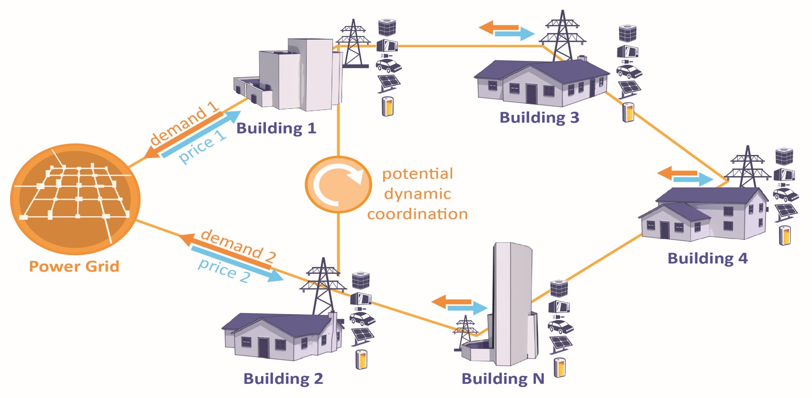

# CityLearn

**Last Updated:** 2026-06-15

## Table of Contents

- [Basic Info](#basic-info)
- [Description](#description)
- [Overview](#overview)
- [Technical Profile](#technical-profile)
- [Grid Context](#grid-context)
- [Related Projects](#related-projects)
- [Maturity & Adoption](#maturity--adoption)
- [Learn More](#learn-more)
- [Additional Notes](#additional-notes)

## Basic Info

- LF Energy webpage:
- Website: https://www.citylearn.net/
- Code: https://github.com/citylearn-project/CityLearn
- Documentation: https://www.citylearn.net/
- Calendar:
- LinkedIn:
- Community:
	- Mailing List:
	- Slack:
- LFX Insights:
- Other:
	- PyPI: https://pypi.org/project/CityLearn/

## Description

Simulation environment for developing and benchmarking control strategies that coordinate energy use across communities of buildings.

## Overview

CityLearn is a simulation environment for sequential decision-making in demand-side building energy management. It models a virtual district of buildings and their distributed energy resources — air-to-water heat pumps, electric heaters, hot- and chilled-water thermal storage, batteries, electric vehicles, and rooftop PV — and presents them as an interactive environment where automated control agents decide, at each time step, how much energy to store or release and how much power heating and cooling devices should supply. An internal backup controller guarantees that building comfort and end-use loads are always met, so agents are free to explore control strategies without risking infeasible operating states. The environment is built on the Farama Foundation's Gymnasium API (originally OpenAI Gym) and supports single- and multi-agent control.

Districts experience peaks in electricity demand that raise costs and strain generation, transmission, and distribution. Reshaping that aggregated demand curve — flattening peaks and shifting consumption — lowers operational and capital costs and supports decarbonization, and coordinating distributed building resources is one of the most promising ways to do it. Reinforcement learning and model predictive control are well suited to this problem, but researchers have historically been unable to compare algorithms fairly because experiments were hard to reproduce. CityLearn solves this by standardizing the observations, actions, reward functions, datasets, and key performance indicators, so any control approach — rule-based, model-predictive, or learning-based — can be evaluated on equal footing against the same scenarios.

CityLearn is used by the machine-learning and reinforcement-learning research community alongside building-energy and power-systems engineers: researchers running comparative studies, developers building and testing controllers, and participants in the CityLearn Challenge competition series (hosted since 2020, run at NeurIPS in 2022 and 2023). Extensive tutorials, a command-line interface, and a visualization dashboard lower the barrier to entry. The project originated in 2019 at the University of Texas at Austin's Intelligent Environments Lab and is led by Zoltan Nagy (now at TU Eindhoven); the v2 series began in 2023 and remains under active development. It is released under the MIT license and is listed in the Digital Public Goods Alliance registry.

*CityLearn overview*

## Technical Profile

### What It Does

Simulates a community of buildings and their distributed energy resources as an interactive environment where control agents make sequential decisions (energy storage charge/discharge, heating/cooling device power) that are evaluated against a standardized set of cost, comfort, emissions, and grid-impact performance indicators.

### Problem(s) Solved

Provides a standardized, reproducible testbed for developing and fairly comparing demand-side control strategies, eliminating the need for each research group or vendor to build its own building-energy simulation. Lets utilities and aggregators estimate the demand flexibility available in residential building stock — flexibility that can defer feeder and transmission upgrades — and lets algorithm developers benchmark reinforcement-learning, model-predictive, and rule-based controllers on common ground before any real-world deployment.

### Key Capabilities

- Energy models of building distributed energy resources: air-to-water heat pumps, electric heaters, hot- and chilled-water thermal storage, batteries, electric vehicles, and PV, with automatic device sizing (PV autosizing via the optional PySAM dependency)
- District-scale modeling: collections of building models form a virtual neighborhood whose aggregated demand curve can be reshaped through load shifting (storage) and load shedding (modulating heating/cooling power)
- Single- and multi-agent control supporting independent, coordinated, and centralized schemes; compatible with rule-based control, model predictive control, and reinforcement learning
- Gymnasium-compatible interface for integration with standard reinforcement-learning frameworks
- Internal backup controller that guarantees building loads and comfort are met regardless of agent actions
- Standardized observations, actions, reward functions, and key performance indicators (cost, carbon emissions, comfort, and grid-level metrics) for fair algorithm comparison
- Dynamic indoor temperature modeling via an LSTM building model, enabling load-shedding flexibility studies (v2.0.0)
- Simulated power outages for resilience and islanded-operation studies (v2.1.0)
- Datasets derived from the U.S. End-Use Load Profiles building-stock database, plus electric-vehicle loads and occupant thermostat overrides (v2.2.0)
- Command-line interface and a visualization dashboard (CityLearn UI, available as a community-contributed tool) for inspecting simulation data and comparing KPIs

### Relevant Standards

None. CityLearn is a simulation environment; it does not implement grid communication or data model standards.

## Grid Context

### Grid Segment

Behind-the-meter

### Function

Operations

<!-- Borderline: demand-response framing could suggest Markets & Programs, but CityLearn's activity content is operational control of DER assets (storage dispatch, device power modulation) at research maturity — the Grid2Op precedent. It does not encode market-clearing or program enrollment/measurement/settlement. See taxonomy.md. -->

### Industry Solution Categories

#### Solution Type

- Demand-Side Control Simulation Environment: Provides a standardized, reproducible environment for developing and benchmarking control strategies that coordinate distributed energy resources across communities of buildings.

#### Component of

None. CityLearn is a standalone research and development environment, not a component of a broader operational system. Control strategies developed and benchmarked in CityLearn could eventually be deployed within a building energy management system or DERMS, but CityLearn itself is not such a component.

### Cross-Cutting Tags

- **Project Intent:** Research
- **AI/ML:** No
- **Deliverable Type:** Software

## Related Projects

- **Grid2Op**: Complementary — both are Gymnasium-based simulation environments for developing control strategies, but on opposite sides of the meter. Grid2Op models transmission grid operations (supply side); CityLearn models demand-side building energy coordination. Linking the two could enable joint study of coordinated supply- and demand-side control. They do not currently integrate.
- **OpenSynth**: Complementary data source — OpenSynth's synthetic smart-meter datasets and grid scenarios could be used to generate prototypical neighborhoods for CityLearn simulations. Both are research-intent projects serving the modeling and ML community.
- **FlexMeasures**: Similar domain, different intent — both coordinate flexible behind-the-meter assets (batteries, EV chargers, heat pumps). FlexMeasures is an applied, production energy management system that computes dispatch schedules for real assets via a REST API; CityLearn is a research environment for developing and benchmarking the control algorithms themselves. Approaches validated in CityLearn could inform applied schedulers like FlexMeasures.

## Maturity & Adoption

### LF Energy Stage

Sandbox

<!-- Approved as an LF Energy Sandbox project by TAC vote on 2026-01-26. Code transfer to LF Energy was in progress as of mid-2026. -->

### Deployment Maturity

R&D

### Supporting / Adopting Organizations

- Intelligent Environments Lab, University of Texas at Austin (originating lab)
- TU Eindhoven (current project lead, Zoltan Nagy)
- ISEP Portugal (SoftCPS research group; contributed the EV module and CityLearn UI visualization dashboard)
- Politecnico di Torino (contributed building-temperature LSTM modules)
- Concordia University (contributed occupant behavior module)

## Learn More

- [CityLearn Challenge 2023 (NeurIPS)](https://www.aicrowd.com/challenges/neurips-2023-citylearn-challenge)
	- Date: 2023-12-01
	- Type: Competition
- [CityLearn Challenge 2022 (NeurIPS)](https://www.aicrowd.com/challenges/neurips-2022-citylearn-challenge)
	- Date: 2022-12-01
	- Type: Competition
- TODO: Add the v2 reference paper (Nweye et al.) and key tutorials with dates once links are confirmed.

## Additional Notes

CityLearn occupies a position analogous to Grid2Op in the LF Energy ecosystem: a research and benchmarking environment aimed primarily at the AI/ML and controls research community rather than at utility operators directly. Its value to utilities is indirect but strategic — it accelerates the development and fair comparison of demand-side control strategies that aggregators and utilities may eventually deploy. A common misconception is that CityLearn is a high-fidelity building simulator; it deliberately uses justified computational simplifications so that simulations scale to many buildings and whole districts, trading single-building fidelity for community-scale tractability.

The project is built around a community-contribution model: several capabilities (the EV module, visualization UI, temperature LSTM, and occupant behavior modules) originate from external research groups rather than the core team. Joining LF Energy is intended to move the project from single-organization stewardship toward shared, vendor-neutral governance.

CityLearn is released under the MIT license. As of mid-2026 the code transfer to LF Energy was still in progress; the canonical repository is at https://github.com/citylearn-project/CityLearn.
