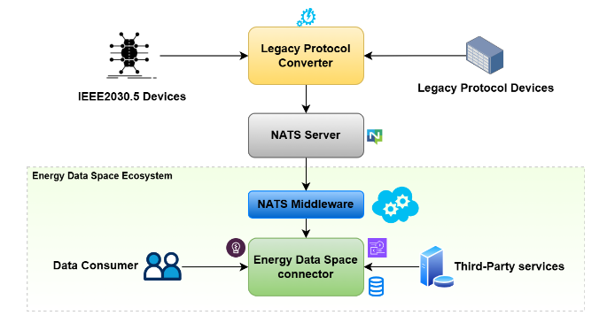

# CUPID

**Last Updated:** 2026-06-01

## Table of Contents

- [Basic Info](#basic-info)
- [Description](#description)
- [Overview](#overview)
- [Technical Profile](#technical-profile)
- [Grid Context](#grid-context)
- [Related Projects](#related-projects)
- [Maturity & Adoption](#maturity--adoption)
- [Learn More](#learn-more)
- [Additional Notes](#additional-notes)

## Basic Info

- LF Energy webpage: https://lfenergy.org/projects/cupid/
- Website:
- Code: https://github.com/cupid-project
- Documentation:
- Calendar: https://zoom-lfx.platform.linuxfoundation.org/meetings/cupid?view=month
- LinkedIn:
- Community:
    - Mailing List: https://lists.lfenergy.org/g/cupid-discussion
    - Slack: https://lfenergy.slack.com/archives/C0A8GALHNH5
- LFX Insights: https://insights.linuxfoundation.org/project/cupid
- Other:

## Description

Interoperability toolkit that enables distributed energy resources, DER management platforms, and legacy field devices to exchange control and telemetry data using IEEE 2030.5 over a publish/subscribe messaging backbone.

## Overview

CUPID (Controllable Unit Protocol Interface for DER) provides a middleware toolkit for IEEE 2030.5–based communication between distributed energy resources (DER) and the platforms that monitor, dispatch, or aggregate them — DERMS, aggregator platforms, and DSO flexibility platforms. Rather than running IEEE 2030.5 over the synchronous HTTP/REST transport defined in the standard, CUPID carries the same resource model over NATS, an asynchronous publish/subscribe messaging system. This shift enables many-to-many communication between aggregators, DER management platforms, inverters, batteries, EV chargers, heat pumps, and other field assets, and is intended to scale to the volume and latency requirements of real-time DER coordination.

The toolkit consists of two core components. The Interoperable Client/Server Library provides developer-facing client and server implementations of IEEE 2030.5 resources over NATS, with schema validation and support for both XML and JSON serialization. The Legacy Protocol Converter (LPC) is a configurable translation layer that bridges field devices speaking Modbus TCP/RTU or MQTT into the IEEE 2030.5 message bus, so that existing inverters, meters, and controllers can participate without firmware replacement. A test suite based on SunSpec's Common Smart Inverter Profile (CSIP) conformance procedures supports validation of implementations.

CUPID originates from the EU Horizon Europe InterSTORE project (2023–2025), which targeted interoperability, hybridisation, and monetisation of storage flexibility. The components are deployable on edge hardware, on-premise servers, or container orchestrators such as Docker and Kubernetes. Primary adopters today are the project's industrial and research partners, with broader uptake targeted in jurisdictions where IEEE 2030.5 is already mandated or widely adopted, such as California and Australia.

*IEEE2030.5 Integration Diagram via NATS*

## Technical Profile

### What It Does

Carries IEEE 2030.5 DER resource exchanges over a NATS publish/subscribe bus, and translates Modbus and MQTT traffic from legacy field devices into the same IEEE 2030.5 message model.

### Problem(s) Solved

Lets DSOs, aggregators, and DER operators coordinate large, heterogeneous fleets of distributed energy resources through a single interoperable protocol — without being limited by the point-to-point, request-response transport defined by the base IEEE 2030.5 standard, and without requiring legacy Modbus or MQTT devices to be replaced.

### Key Capabilities

- IEEE 2030.5 client and server libraries that exchange resources over NATS messaging instead of HTTP/REST, enabling asynchronous many-to-many communication
- XML and JSON serialization of IEEE 2030.5 resources with schema validation
- Legacy Protocol Converter that maps Modbus TCP/RTU and MQTT payloads to and from IEEE 2030.5 messages through configurable transformation rules
- Automated conformance testing harness based on SunSpec CSIP test procedures
- Deployable on edge devices, single hosts, and container orchestrators (Docker, Kubernetes)

### Relevant Standards

- IEEE 2030.5 — Smart Energy Profile for DER communication; CUPID implements the resource model and behaviors of the standard, carried over NATS rather than the HTTP/REST transport specified in the base standard
- SunSpec Common Smart Inverter Profile (CSIP) — the test suite is based on CSIP conformance procedures

## Grid Context

### Grid Segment

Behind-the-meter (primary), Distribution (secondary)

<!-- Behind-the-meter is primary because IEEE 2030.5 and the project's use cases target DER assets (BESS, EV chargers, heat pumps, rooftop PV, residential/commercial flexibility) on the customer side of the meter. Distribution is secondary because aggregator and DSO platforms that orchestrate those DERs sit on the distribution side and consume the same protocol. -->

### Function

Operations

<!-- CUPID carries operational data between DERs and the platforms that dispatch them. Protocols and middleware that carry operational data belong in Operations rather than Markets & Programs, even when the downstream use case is flexibility monetization. -->

### Industry Solution Categories

#### Solution Type

- DER Communication Middleware: Provides client/server libraries and a legacy protocol converter that let DER assets and the platforms managing them exchange IEEE 2030.5 data over a publish/subscribe bus.

#### Component of

- DERMS: Provides the device-facing communication layer that a DER management system can use to monitor and dispatch a heterogeneous fleet of DERs through a single standardized protocol.

### Cross-Cutting Tags

- **Project Intent:** Applied
- **AI/ML:** No
- **Deliverable Type:** Software

## Related Projects

- **OpenLEADR**: Complementary at different layers of a flexibility stack — OpenLEADR implements OpenADR for program-level demand response signaling between DSOs/aggregators and customer sites; CUPID implements IEEE 2030.5 for direct DER monitoring and control. An aggregator can receive a high-level DR event via OpenLEADR and translate it into device-level dispatch via CUPID.
- **FlexMeasures**: Complementary — FlexMeasures is an aggregator-side optimization platform that decides what each DER should do; CUPID can serve as the device-facing protocol layer that carries those dispatch decisions to and from the assets.

## Maturity & Adoption

### LF Energy Stage

Sandbox

### Deployment Maturity

R&D

<!-- The InterSTORE project ran the toolkit in four living labs (Italy, Germany, Austria, Portugal) covering e-mobility, commercial, residential, and industrial flexibility scenarios, but it is unclear what continued use, if any, persists now that the grant project has concluded. Kept at R&D until ongoing production or piloting deployments by adopters can be confirmed. -->

### Supporting / Adopting Organizations

- RWTH Aachen University (project coordinator)
- INESC TEC
- CyberGrid
- Sunesis
- Forschungszentrum Jülich
- enliteAI

<!-- Drawn from the LF Energy project page's contributor list. The wider InterSTORE consortium (Eaton, Enel X, Engineering, HESSTec, Capwatt, EASE, VDE) participated in the originating grant project but are not currently listed as CUPID contributors on the LF Energy page. -->

## Learn More

- [TAC proposal](https://github.com/lf-energy/tac/issues/383)
    - Date: 2025-01-30
    - Type: TAC proposal
- [CUPID TAC presentation](https://tac.lfenergy.org/meetings/2025/2025-05-13/CUPID.pdf)
    - Date: 2025-05-13
    - Type: Presentation
- [InterSTORE project website](https://interstore-project.eu/interstore-project/)
    - Type: Originating project

## Additional Notes

CUPID is not synonymous with InterSTORE. InterSTORE was a three-year Horizon Europe research and innovation action covering interoperability, hybridisation, and monetisation of storage flexibility, with a broader scope including data spaces, flexibility aggregation services, and distributed energy management software. CUPID is the subset of InterSTORE's open-source assets focused on the IEEE 2030.5 communication layer that the consortium chose to continue in LF Energy; other InterSTORE outputs remain outside the project.

The central technical bet is that IEEE 2030.5 — already mandated for DER interconnection in California (Rule 21) and Australia (CSIP-AUS) — is the most viable basis for a globally interoperable DER protocol, but that its REST/HTTP transport limits its applicability to large, real-time, many-to-many DER coordination. Carrying the same resource model over NATS preserves the standard's data semantics while removing that transport constraint. This is a deliberate extension of the standard rather than a strict conformance implementation; deployments that require base-standard interoperability with non-NATS IEEE 2030.5 endpoints will need a gateway.