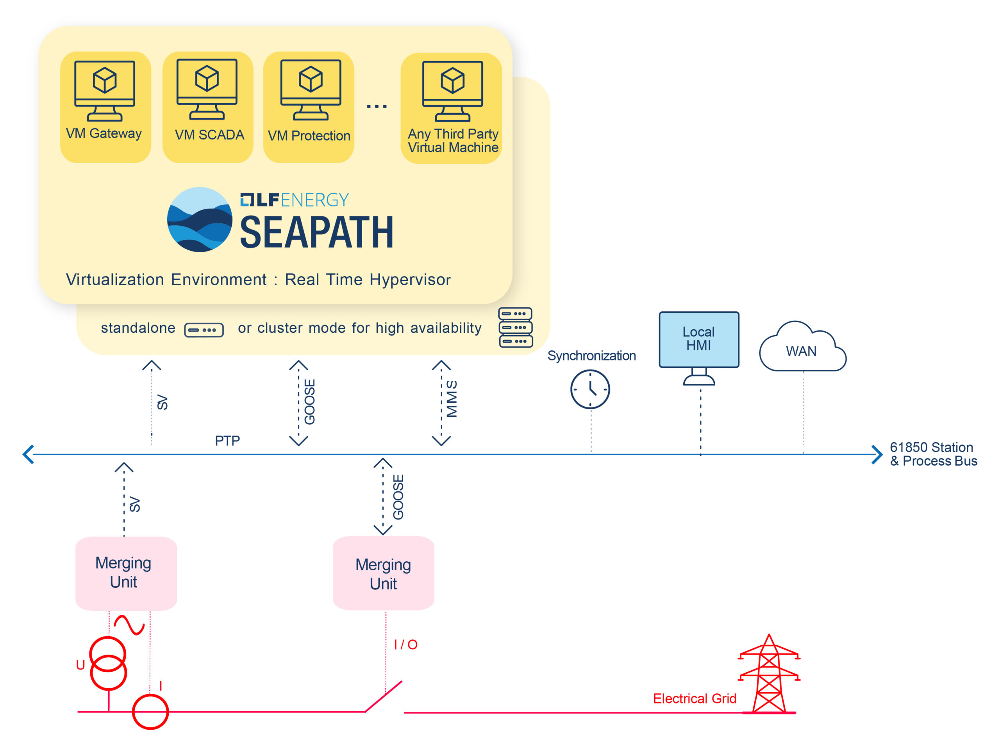
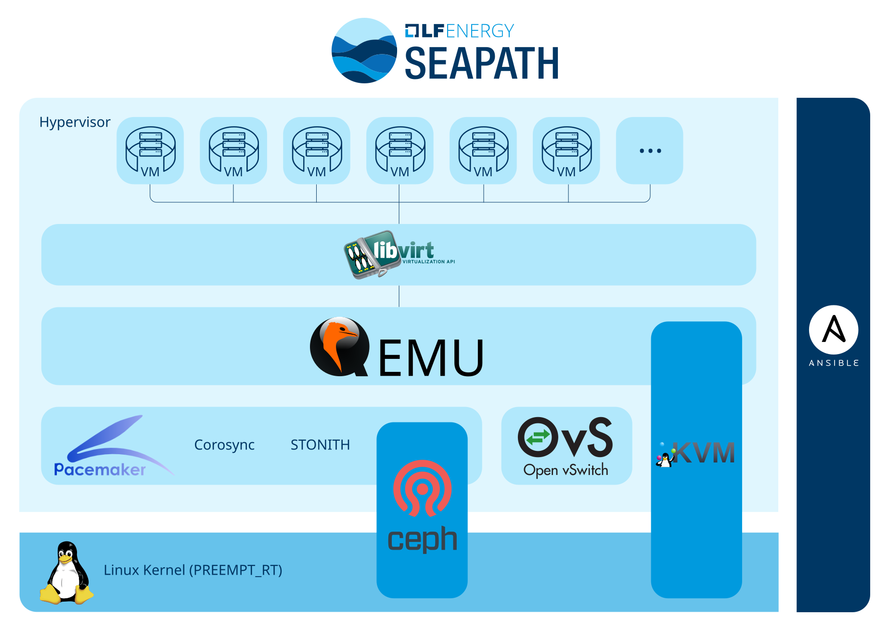

# SEAPATH

**Last Updated:** 2026-08-21

## Table of Contents

- [Basic Info](#basic-info)
- [Description](#description)
- [Overview](#overview)
- [Technical Profile](#technical-profile)
- [Grid Context](#grid-context)
- [Related Projects](#related-projects)
- [Maturity & Adoption](#maturity--adoption)
- [Learn More](#learn-more)
- [Additional Notes](#additional-notes)

## Basic Info

- LF Energy webpage: https://lfenergy.org/projects/seapath/
- Website: https://seapath.energy/
- Code: https://github.com/seapath
- Documentation: https://lf-energy.atlassian.net/wiki/spaces/SEAP/overview
- Calendar: https://zoom-lfx.platform.linuxfoundation.org/meetings/seapath?view=month
- LinkedIn: https://www.linkedin.com/showcase/seapath-project/
- Community:
	- Mailing List: https://lists.lfenergy.org/g/SEAPATH
	- Slack: https://lfenergy.slack.com/archives/C01EH8ZLJTC
- LFX Insights: https://insights.linuxfoundation.org/project/seapath
- Other:

## Description

Industrial-grade real-time virtualization platform for hosting protection, automation, and control applications in digital substations.

## Overview

SEAPATH is a real-time virtualization platform that enables substation functions — protection, automation, HMI, gateways, monitoring — to run as software on shared servers instead of dedicated hardware devices. It is designed for deterministic performance and high availability, typically deployed as a cluster of three servers with automatic failover and distributed storage. The platform uses an infrastructure-as-code approach for reproducible deployment across substations, and runs on several Linux bases: Debian (package-based, easier to maintain), Yocto (source-built, fully reproducible builds), and enterprise distributions.

Substations today rely on dedicated hardware for each function — separate physical devices for protection relays, HMIs, gateways, and automation controllers, often from a single vendor in a turnkey arrangement. This ties the utility to one supplier, limits flexibility, and means that adding or updating functions requires new hardware. SEAPATH decouples applications from hardware by providing a vendor-neutral platform layer. Multiple vendors' applications can run as virtual machines on the same cluster, with the utility controlling the platform independently. Cluster-based redundancy enables new resilience patterns — when a server fails, VMs automatically migrate to surviving nodes — that aren't possible with dedicated devices.

SEAPATH is running in production substations. RTE (the French TSO) uses SEAPATH in its R#SPACE program for virtualizing HMI, gateway, and automation functions, and is working toward virtualizing protection functions; as of the project's July 2026 annual review, RTE reported six substations in operation with four more planned by year end, and EcoPhi reported 22 SEAPATH instances running in substations. Alliander, Elia, and Avangrid are evaluating the platform in lab environments. National Grid Electricity Transmission and GE Vernova have validated SEAPATH for virtualized protection use cases. The platform is hardware-agnostic across x86_64 servers with virtualization support (VT-x/VT-d); production environments typically use IEC 61850-certified server hardware. All contributions are validated through 1000+ automated tests — covering resiliency, cybersecurity, real-time performance, and IEC 61850 latency — run on physical hardware in CI facilities at RTE and Savoir-faire Linux.

*Image shows SEAPATH and how it fits in a substation. Best used for utility engineer audience.*

*Image shows SEAPATH tech stack. Best used for IT software developer audience.*

## Technical Profile

### What It Does

Provides a real-time, high-availability virtualization platform for running multiple vendors' protection, automation, and control applications on shared server hardware in substations.

### Problem(s) Solved

Enables utilities to virtualize substation functions on a vendor-neutral platform they control, eliminating dependence on single-vendor turnkey systems for the computing infrastructure that hosts PAC applications.

### Key Capabilities

- **Real-time virtualization**: PREEMPT_RT Linux kernel with KVM provides deterministic performance for time-critical substation applications
- **High-availability clustering**: Three-server clusters with automatic VM failover via Corosync/Pacemaker; when a server fails, VMs migrate to surviving nodes
- **Distributed storage**: Ceph replicates VM disk images across cluster nodes, ensuring data availability during hardware failures
- **Vendor-neutral application hosting**: Supports virtual machines from multiple vendors on the same cluster (e.g., ABB SSC600 SW documented as a supported third-party VM)
- **Infrastructure as code**: Ansible-based deployment and configuration enables reproducible, scalable provisioning across substations
- **Time synchronization**: Hardware PTP (IEEE 1588) and NTP support for precision timing required by substation applications
- **Cybersecurity hardening**: Security-by-design approach with ANSSI BP-028 compliance testing and security-focused CI validation
- **Multiple OS flavors**: Debian (package-based, easier maintenance) and Yocto (source-built, fully reproducible) to match different operational preferences, plus image builds for enterprise Linux distributions — SUSE Linux Enterprise Server 16 and RHEL 9 / CentOS Stream 9

### Relevant Standards

None

## Grid Context

### Grid Segment

Transmission, Distribution

### Function

Operations — Substation Digitalization

### Industry Solution Categories

#### Solution Type

- Virtualization Platform: Provides real-time computing infrastructure for hosting virtualized PAC applications in substations.

#### Component of

- Digital Substation: Serves as the platform layer in a digital substation architecture, hosting the virtualized applications that replace dedicated hardware devices for protection, automation, HMI, and gateway functions.

### Cross-Cutting Tags

- **Project Intent:** Applied
- **AI/ML:** No
- **Deliverable Type:** Software

## Related Projects

- **CoMPAS**: Complements SEAPATH in a digital substation architecture. CoMPAS provides tooling for IEC 61850 system configuration (SCL files); SEAPATH provides the platform on which the configured applications run. The SEAPATH documentation lists CoMPAS as an integration point.
- **GEISA**: Both address edge computing for grid infrastructure, but for different deployment profiles. SEAPATH targets higher-power, lower-quantity deployments (substation servers running clustered VMs), while GEISA targets lower-power, higher-quantity deployments (distributed edge devices running lightweight applications).

## Maturity & Adoption

### LF Energy Stage

Graduated

### Deployment Maturity

Production

### Supporting / Adopting Organizations

Maintained by the project in [ADOPTERS.md](https://github.com/seapath/.github/blob/main/ADOPTERS.md), with additional context tracked at [SEAPATH Initiatives in the World](https://lf-energy.atlassian.net/wiki/spaces/SEAP/pages/367099911/SEAPATH+Initiatives+in+the+World).

#### Utilities

- RTE (production)
- Alliander (lab evaluation)
- Elia (lab evaluation)
- Avangrid (lab evaluation)
- Amprion (evaluation)
- National Grid (evaluation)
- Enedis (evaluation)
- Hydro-Québec (evaluation)

#### vIED and PAC Vendors

- ABB
- GE Vernova
- Schneider Electric
- Siemens Energy
- Hitachi Energy
- Sprecher Automation
- SCLE
- SDEL

#### Other Vendors

- EcoPhi (production; substation monitoring and analytics applications)
- Welotec (production; hardware platform validated with SEAPATH)
- Advantech
- Omicron

#### Software and Integrators

- Savoir-faire Linux
- Red Hat
- SUSE
- Smile
- RTE International
- Capgemini
- Sopra Steria
- CIRCE

## Learn More

- [SEAPATH 2026 Annual Review to the LF Energy TAC](https://github.com/lf-energy/tac/blob/main/meetings/2026/2026-07-21/SEAPATH_2026_Annual_Review.pdf)
	- Date: 2026-07-21
	- Type: Presentation
	- [TAC meeting notes](https://tac.lfenergy.org/meetings/2026/2026-07-21/)
- [EcoPhi on SEAPATH: Virtualizing Substation Monitoring and Analytics for Grid Efficiency and Reliability](https://lfenergy.org/ecophi-on-seapath-virtualizing-substation-monitoring-and-analytics-for-grid-efficiency-and-reliability/)
	- Date: 2025-12-01
	- Type: Case Study
- [National Grid Electricity Transmission and GE Vernova Collaborate on LF Energy SEAPATH to Advance Virtualized Protection and Control](https://lfenergy.org/national-grid-electricity-transmission-and-ge-vernova-collaborate-on-lf-energy-seapath-to-advance-virtualized-protection-and-control/)
	- Date: 2025
	- Type: Case Study
- [RTE Deploys LF Energy SEAPATH for Virtual Protection Automation and Control](https://lfenergy.org/rte-deploys-lf-energy-seapath-for-virtual-protection-automation-and-control/)
	- Date: 2024
	- Type: Case Study
- [SEAPATH: What's New - Recent Improvements and Future Developments](https://lfenergysummiteu2025.sched.com/event/26IxV/seapath-whats-new-recent-improvements-and-future-developments-eloi-bail-savoir-faire-linux)
	- Date: 2025-09-10
	- Type: Presentation
- [What Do Virtualization and SEAPATH Really Change for RTE?](https://lfenergysummiteu2025.sched.com/event/26Ixk/what-do-virtualization-and-seapath-really-change-for-rte-bastien-desbos-rte)
	- Date: 2025-09-10
	- Type: Presentation
- [A Case Study on Testing LFE Seapath at National Grid Electricity Transmission](https://lfenergysummiteu2025.sched.com/event/26Ixn/a-case-study-on-testing-lfe-seapath-at-national-grid-electricity-transmission-thomas-charton-national-grid-electricity-transmission)
	- Date: 2025-09-10
	- Type: Presentation
- [Streamlining SEAPATH Deployment and Management in Electrical Substations](https://lfenergysummiteu2025.sched.com/event/26J6Y/streamlining-seapath-deployment-and-management-in-electrical-substations-matias-vara-red-hat-erwann-roussy-savoir-faire-linux)
	- Date: 2025-09-10
	- Type: Presentation
- [Deploying a Virtual IED on LF Energy SEAPATH, Advices and Experience Feedback](https://lfenergysummit2024.sched.com/event/1ehJL/deploying-a-virtual-ied-on-lf-energy-seapath-advices-and-experience-feedback-erwann-roussy-savoir-faire-linux-camilo-de-arriba-ge-vernova)
	- Date: 2024-09-06
	- Type: Presentation
- [SEAPATH - Current Application and Perspectives](https://lfenergysummit2024.sched.com/event/1ehJF/seapath-current-application-and-perspectives-bastien-desbos-florent-carli-rte)
	- Date: 2024-09-06
	- Type: Presentation

## Additional Notes

The SEAPATH acronym officially means "Software Enabled Automation Platform and Artifacts (Therein)". However, it is rarely used and should not be spelled out unless explicitly directed to do so.

SEAPATH is, to our knowledge, the only open source real-time virtualization platform purpose-built for substation PAC applications. The proprietary alternative in this space is VMware Edge Compute Stack (Broadcom), which offers a vPAC Ready Infrastructure reference architecture through the vPAC Alliance (whose founding members include Advantech, Intel, VMware, and ABB). SEAPATH's open source model gives utilities control over the platform layer rather than depending on a proprietary virtualization vendor — a strategic consideration given that substation infrastructure operates on 20+ year lifecycles.

SEAPATH reached LF Energy Graduated stage in 2026. In the year leading up to it the project released SEAPATH 2.0 and its TSC voted to transfer the project to LF Europe governance.

RTE launched the VIP'R (Virtual PAC RTE) R&D project in 2025 with ABB and Schneider Electric to extend SEAPATH from hosting automation and monitoring functions to hosting virtualized protection functions (vIEDs). This represents the next major frontier for substation virtualization, as protection is the most safety-critical function and has the strictest real-time requirements.

Two organization lists exist and they differ. The project-maintained ADOPTERS.md gives per-organization status detail and is the more reliable source. The ecosystem slide in the July 2026 annual review is broader, grouping logos as "contributing and/or evaluating in lab/pre-production and/or using in production" without distinguishing between those. Hitachi Energy, Sprecher Automation, Advantech, Hydro-Québec, Smile, Capgemini, Sopra Steria, and CIRCE appear only on the slide, so the nature and depth of their involvement is unconfirmed.

Contribution activity is concentrated in two organizations. LFX Insights data presented in the July 2026 annual review shows RTE and Savoir-faire Linux accounting for 49% and 47% of 2025 contributions respectively, and Savoir-faire Linux at 84% for the first half of 2026, with the project noting that much of that 2026 work was sponsored (SLES support, Qualcomm board support). This is a normal pattern for a platform project with a lead utility and a lead integrator, but it is worth tracking as the contributor base broadens.

An Arm64 port exists but is early. The `meta-seapath-qcom` Yocto layer targets a single Qualcomm evaluation board (qcs9075-iq-9075-evk), and its distro configuration explicitly disables both clustering and security hardening to allow debugging. The production platform remains x86_64.
